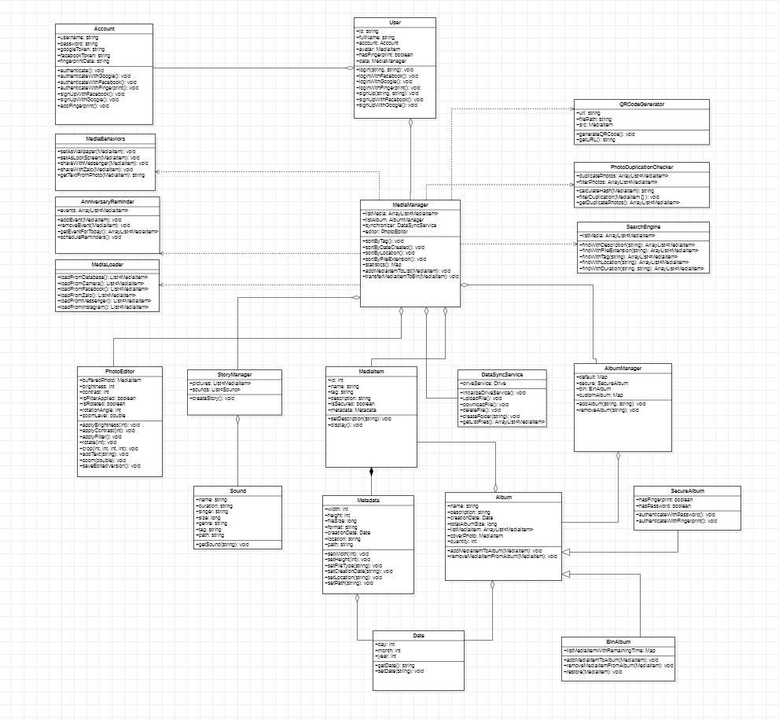
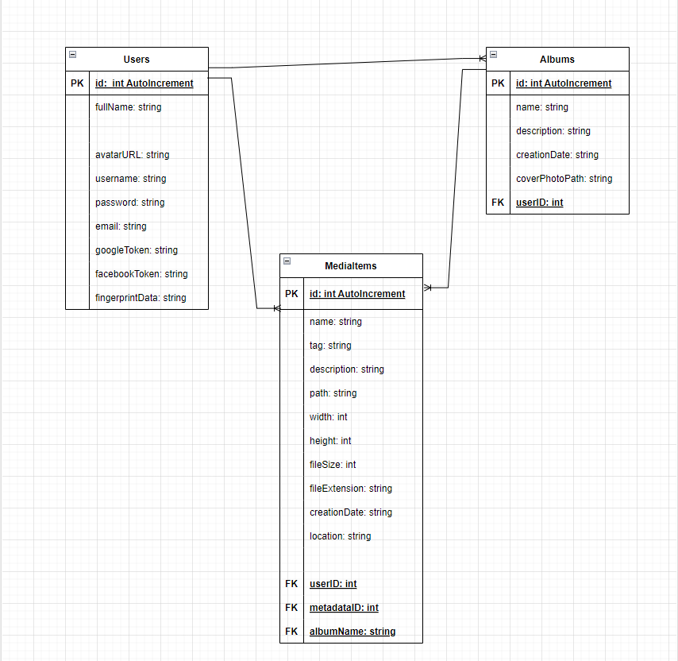

# 🧩 Thiết kế lớp
I. Các lớp phân tích từ use case :
1. User:
  - Properties: tên, email, mật khẩu, thông tin tài khoản GG/ FB ?
  - Method: Đăng ký/ Đăng nhập/ Đăng xuất/ Quản lý tài khoản

2. MediaItem: đại diện cho các phương tiện ảnh/ gif/ video
- Properties: name, tag, size, dateCreated, location, isSecured, note, fileExtension, path..
- Method:

3. Album:
- Properties: tên, mô tả, danh sách ảnh...
- Method:

4. PhotoEditor: quản lý công cụ chỉnh sửa ảnh và bộ lọc
- Properties: brightness, contrast, isFilterApplied, isRotated ,....
- Method: cắt/ xoay/ hiệu ứng...

5. MediaManager: quản lý quá trình tải ảnh lên từ thiết bị hoặc máy ảnh của người dùng
- Properties:
- Method: tải ảnh lên từ thiết bị/ máy ảnh của user

6. AlbumManager: quản lý lưu trữ và quản lý các phương tiện, tổ chức vào các album
- Properties:
- Method: tổ chức vào album, quản lý lưu trữ

7. SearchEngine: quản lý chức năng tìm kiếm ảnh theo mô tả, loại extension, tag...
- Properties:
- Method: tìm kiếm theo tên, loại extension, kích thước, location,...

8. SecurityManager: quản lý bảo mật và quyền truy cập, xác thực và quản lý truy cập đối với album
- Properties:
- Method: xác thực/ quản lý truy cập ?

9. DataSyncService: quản lý đồng bộ hóa dữ liệu với dịch vụ trực tuyến như Google Drive
- Properties: driveService
- Method: upload, download, delete files...

10. NotificationManager: quản lý thông báo và nhắc nhở về kỉ niệm, ảnh liên quan...
- Properties:
- Method: thông báo, nhắc kỉ niệm..

11. ImageDuplicationChecker: kiểm tra và quản lý ảnh trùng lặp ...
- Properties: duplicateImages, filterImages, 
- Method: calculateHash, filterDuplication,...

12. ImageTransformer: chuyển đổi ảnh thành văn bản,
- Properties: MediaItem[]
- Method: getTextFromPhoto

___

II. [Thể hiện mối kết hợp thông qua UML](./uml.diagram/ClassModeling.mdj)

___

III. [Chuyển đổi lớp sang bảng dữ liệu/ Chuẩn hóa lược đồ](.uml.diagram/DB.Schema.drawio)

___

